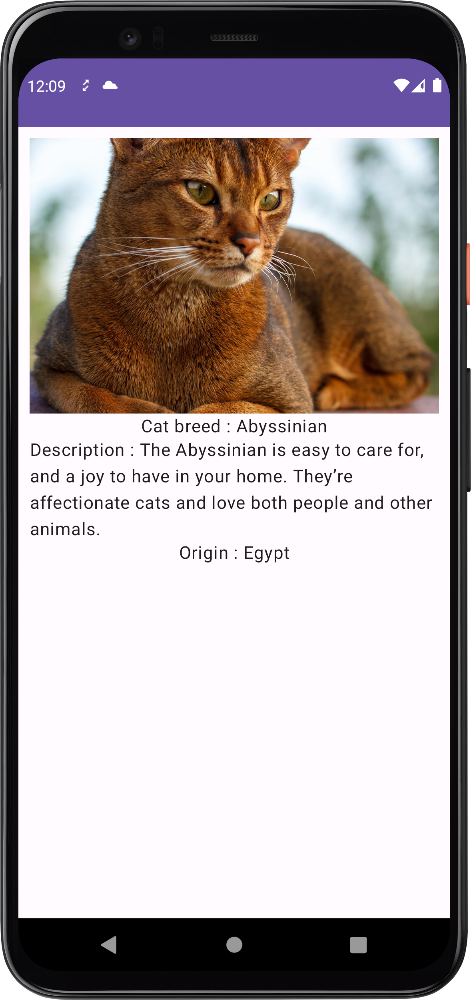

# Pussy Cat Application

This is a simple Android app that consumes the CATs API to display various images of cats
The objective of this project was to learn how dependency injection works  with the Koin 
framework and also how to use Ktor for network requests

The project also uses Chucker to debug network requests

## Screenshots of the App

 

